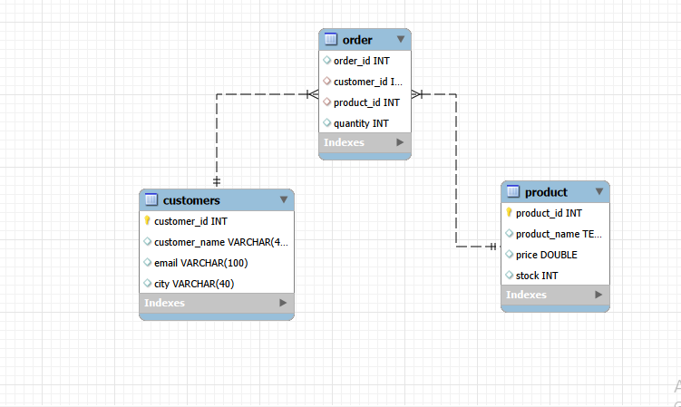

# E-commerce Database Design (SQL)

A simple relational database project built in MySQL that models a small
e-commerce system with **Products**, **Customers**, and **Orders**.
Created as a practice assignment to demonstrate core SQL concepts —
table design, constraints, relationships, and data analysis queries.

## 📂 Project Structure

```
├── schema.sql          # Table definitions, primary/foreign keys, constraints
├── sample_data.sql     # Sample INSERT statements to populate the tables
├── queries.sql         # Analysis queries (WHERE, ORDER BY, GROUP BY, HAVING)
├── images/
│   └── er-diagram.png  # Entity-Relationship diagram
└── README.md
```

## 🖼️ ER Diagram



## 🗄️ Database Design

**product**
| Column       | Type          | Notes                     |
|--------------|---------------|----------------------------|
| product_id   | INT (PK)      |                            |
| product_name | VARCHAR(50)   |                            |
| price        | DECIMAL(10,2) | CHECK (price > 0)         |
| stock        | INT           | default 0                 |

**customers**
| Column        | Type         | Notes         |
|---------------|--------------|---------------|
| customer_id   | INT (PK)     |               |
| customer_name | VARCHAR(40)  |               |
| email         | VARCHAR(100) |               |
| city          | VARCHAR(40)  |               |
| phone         | INT (UNIQUE) |               |

**order**
| Column      | Type              | Notes                          |
|-------------|-------------------|----------------------------------|
| order_id    | INT (PK, AUTO_INCREMENT) |                          |
| product_id  | INT (FK → product)       |                          |
| customer_id | INT (FK → customers)     |                          |
| quantity    | INT               |                                  |

## 🔑 Concepts Covered
- `CREATE TABLE`, `ALTER TABLE`, `DROP TABLE`
- Primary keys, foreign keys, `CHECK` and `UNIQUE` constraints
- `INSERT`, `UPDATE`, `DELETE`
- Filtering with `WHERE`
- Sorting with `ORDER BY`
- Aggregation with `GROUP BY` and `HAVING`
- Joins across related tables via foreign keys

## ▶️ How to Run
1. Install MySQL (or use any MySQL-compatible client, e.g. MySQL Workbench).
2. Run the files in this order:
   ```sql
   SOURCE schema.sql;
   SOURCE sample_data.sql;
   SOURCE queries.sql;
   ```
3. Explore the queries in `queries.sql` to see sample analysis output.

## 📌 Notes
- `order` is a MySQL reserved keyword, so it is always referenced using
  backticks: `` `order` ``.

## 👨‍💻 Author

**Ashish Kumar**

- GitHub: https://github.com/ashishsmart2001-hub
- Tested on MySQL 8.x.
- 
